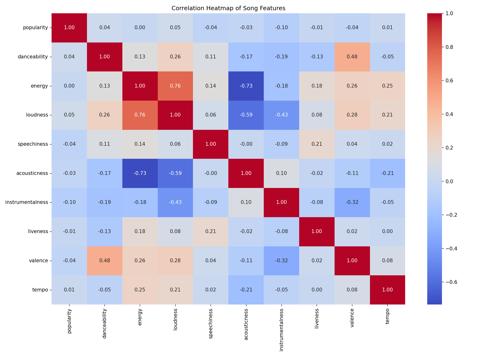
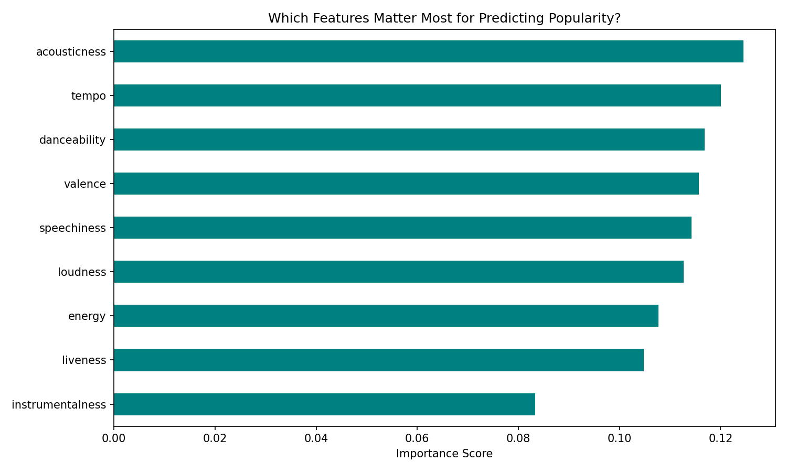
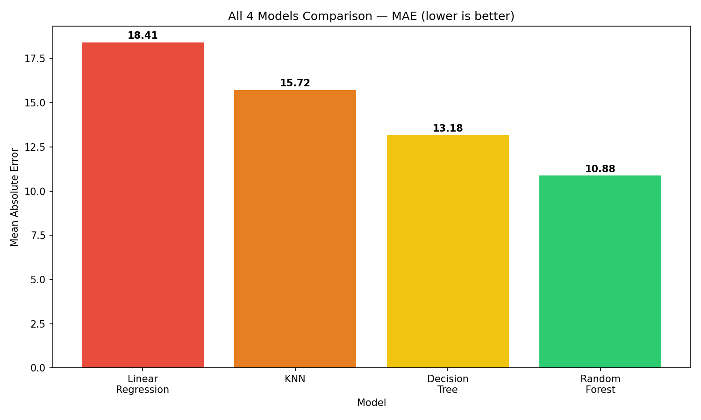
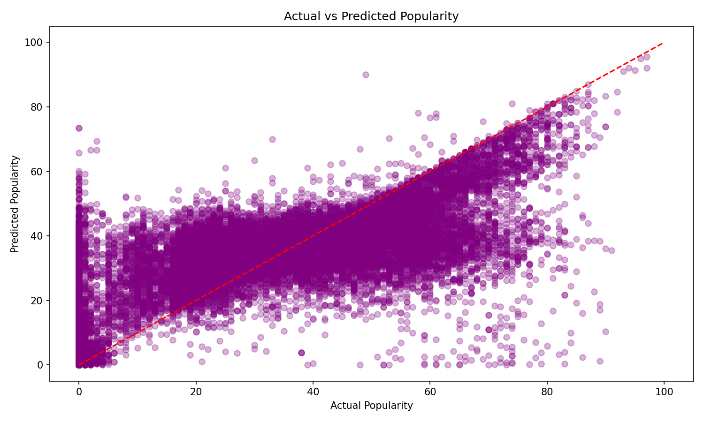
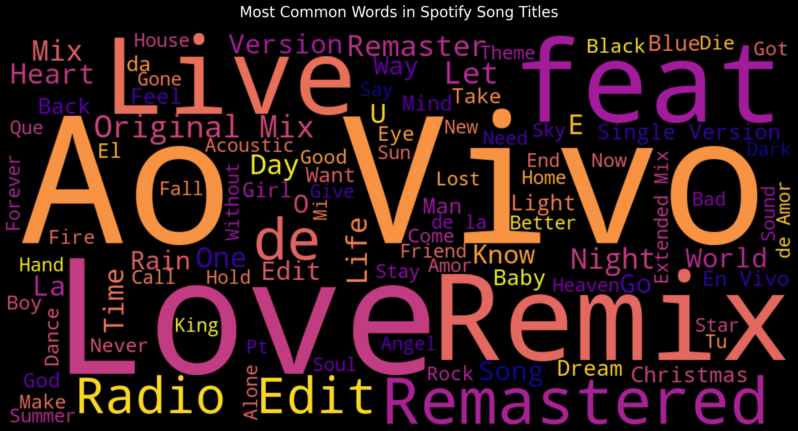

# Spotify Analysi

Exploratory data analysis and machine learning project for understanding Spotify track features and predicting popularity scores.

## Project Overview

This project analyzes a Spotify tracks dataset with audio features such as danceability, energy, loudness, acousticness, valence, tempo, and popularity. The notebook includes exploratory charts, correlation analysis, word clouds, sentiment analysis on song titles, and model comparison for predicting track popularity.

## Dataset

The full dataset is not committed to this repository because it is a large data file. To run the notebook locally, place the dataset in the project root as:

```text
dataset.csv
```

The dataset used matches the public Spotify Tracks Dataset format with 114,000 rows and 21 columns, commonly available on Kaggle:

https://www.kaggle.com/datasets/maharshipandya/-spotify-tracks-dataset

## Model Artifact

The trained model file is also not committed because it is large:

```text
spotify_model.pkl
```

You can regenerate it by running the model training cells in the notebook.

## Key Results

- Random Forest performed best among the tested models.
- Random Forest MAE with 50 trees: approximately 10.88.
- Random Forest MAE with 200 trees: approximately 10.79.
- Linear Regression MAE: approximately 18.41.
- KNN MAE: approximately 15.72 without scaling and 15.04 with scaling.
- Improved Neural Network MAE: approximately 16.59.

## Visualizations

### Correlation Heatmap



### Feature Importance



### Model Comparison



### Actual vs Predicted Popularity



### Common Song Title Words



## Project Files

- `Spotify Analysis.ipynb` - main analysis notebook
- `requirements.txt` - Python dependencies
- `*.png` - exported charts used in the analysis
- `dataset.csv` - local dataset file, ignored by Git
- `spotify_model.pkl` - local trained model artifact, ignored by Git

## Setup

Install dependencies:

```bash
pip install -r requirements.txt
```

Then open and run:

```text
Spotify Analysis.ipynb
```

## Notes

The repository keeps large generated artifacts out of Git so it remains lightweight and easy to clone. If you need to publish the trained model, use Git LFS or attach the model as a release artifact instead of committing it directly.
